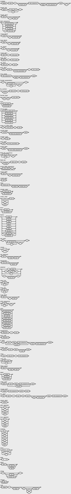

# Titania Programming Language

Based on the [Oberon-07](https://people.inf.ethz.ch/wirth/Oberon/Oberon07.Report.pdf) programming language designed by the late [Niklaus Wirth](https://en.wikipedia.org/wiki/Niklaus_Wirth).

This is designed to be a language to teach compiler development with.

Meaning behind the name:
 * Titania is the wife of Oberon (Fairy King) in Shakespeare's [_A Midsummer Night's Dream_](https://en.wikipedia.org/wiki/Titania_(A_Midsummer_Night%27s_Dream))
 * This is just a codename, and probably not final for this teaching language

This design of the language has flaws in it on purpose. They exist there as a way to teach language design along side compile construction.

## Grammar

```
module = "module" ident ";" [import_list] decl_sequence
         ["begin" stmt_sequence] "end" [";"].

import_list = "import" import_decl {"," import_decl} ";".
import_decl = ident [":=" ident].

decl_sequence = { const_block | type_block | var_block | proc_decl ";" }.

const_block = "const" {const_decl ";"}.
type_block  = "type"  {type_decl  ";"}.
var_block   = "var"   {var_decl   ";"}.

const_decl = ident "=" const_expr.
type_decl  = ident ":" struct_type.
var_decl   = ident_list ":" type.

proc_decl = "proc" ident [formal_parameters] ";" proc_body.
proc_body = decl_sequence ["begin" stmt_sequence] "end".

formal_parameters = "(" [fp_section {";" fp_section} [";"]] ")".
fp_section        = ["var"] ident_list ":" formal_type.
formal_type       = ["[" "]"] qual_ident.

type                = qual_ident | struct_type.
struct_type         = array_or_slice_type | record_type | pointer_type | proc_type | enum_type.
array_or_slice_type = "[" (const_expr) "]" type.
record_type         = "record" [field_list_sequence] "end".
pointer_type        = "^" type.
proc_type           = "proc" formal_parameters.
enum_type           = "enum" [enum_field_sequence] "end".

field_list_sequence = field_list {";" field_list} [";"].
field_list          = ["using"] ident_list ":" type.

enum_field_sequence = enum_field {";" enum_field} ";".
enum_field          = ident ["=" const_expr].

const_expr  = expr.
expr        = simple_expr [relation simple_expr].
simple_expr = unary_expr {add_operator unary_expr}.
unary_expr  = ["+" | "-" | "not"] term.
term        = factor {mul_operator factor}.
factor      = integer | real | string
            | "nil" | "true" | "false"
            | set_expr
            | "(" expr ")" | designator.

set_expr     = "{" [set_element {"," set_element} [","]] "}".
range        = "..<" | "..=".
set_element  = expr [range expr].

designator = qual_ident {selector}.
selector   = "." ident
           | "[" expr_list "]"
           | "^"
           | "(" [expr_list] ")".

ident_list = ident {"," ident}.
expr_list  = expr  {"," expr}.
qual_ident = ident ["." ident].

stmt_sequence = stmt {";" stmt} [";"].
stmt = [assignment | proc_call | if_stmt | switch_stmt |
        while_stmt | repeat_stmt | for_stmt | return_stmt ].

assignment = designator ":=" expr.
proc_call  = designator.

if_stmt = "if" expr "then" stmt_sequence
          {"elseif" expr "then" stmt_sequence}
          ["else" stmt_sequence]
          "end".

switch_stmt = "switch" expr "then" { case } "end".
case        = "case" case_list ":" stmt_sequence.
case_list   = label_range {"," label_range}.
label_range = label [range label].
label       = integer | string | qual_ident.

while_stmt = "while" expr "then" stmt_sequence
             {"elseif" expr "then" stmt_sequence}
             "end".
repeat_stmt = "repeat" stmt_sequence "until" expr.
for_stmt    = "for" ident ":=" expr "to" expr ["by" const_expr] "then" stmt_sequence "end".

return_stmt = "return".

add_operator = "+" | "-" | "xor" | "or".
mul_operator = "*" | "/" | "%"   | "and".
relation     = "=" | "<>" | "<" | "<=" | ">" | ">=" | "in".

letter  = "A"…"Z" | "a"…"z" | "_".
digit   = "0"…"9".
ident   = letter {letter | digit}.
string  = '"' { char | escape_seq } '"'.
integer = digit { digit }.
real    = integer "." [integer] ["e" ["+" | "-"] integer].
```

Notes:
 * `expr` permits at most one `relation`, so relational operators are
   non-associative (e.g. `a < b < c` is not valid).
 * A `case` expression must be an integer-like value (`byte`, `char`, `int`);
   its labels are constant, may be single values or `lo ..< hi` or `lo ..= hi` ranges, and must not overlap.
   `case` has no `else`; if no label matches, the statement is skipped.
 * There is no `char` literal: a single-character constant is written as a
   `string` and converted with `ord`/`chr`.
 * A `var` parameter (`fp_section` beginning with `var`) is passed by reference;
   assigning to it updates the caller's argument.

### Keywords

```
and     begin   by      case    const   else    elseif  end
false   for     if      import  in      module  nil     not
or      proc    record  repeat  return  switch  then    to
true    type    until   using   var     while   xor
```

### Operators

```
+    .   (   )   =  <>
-    ,   [   ]   <  <=
*    ;   {   }   >  >=
/    %   :=  :   ^
..<  ..=
```

### Tokenizer Semicolon Insertion Rules

When a newline is seen after the following token kind, a semicolon is inserted, otherwise no semicolon is inserted:

* Identifiers
* Integer, Real, and String literals
* `true` and `false`
* `nil`
* `^`
* `)`, `]`, `}`
* `end`


### Built-in Procedures

Note: These will be added to as the compiler develops.

Notation:
  * `x, y` are values
  * `s` a string
  * `i, n` integers
  * `r` a real
  * `p` a pointer
  * `set_var` a `set` variable
  * `T` a type.

Parameters written `var` must be addressable (a variable, field, indexed element, or `p^`).

#### Arithmetic and bit manipulation
```
abs(x)        - absolute value of x; result has the same numeric type as x
lsl(x, n)     - logical shift of x left by n (x and n share an integer type)
asr(x, n)     - arithmetic shift of x right by n
ror(x, n)     - 64-bit rotate of x right by n
odd(x)        - true if the integer x is odd (x % 2 <> 0); result is bool
floor(r)      - largest whole number <= r, returned as a real
ceil(r)       - smallest whole number >= r, returned as a real
```

#### Conversions (characters)
```
chr(i)        - the char whose code point is the int i
ord(s)        - the int code point of the single-character string constant s
```

#### In-place update
```
inc(var x)        - x := x + 1        (x an addressable numeric)
inc(var x, y)     - x := x + y
dec(var x)        - x := x - 1
dec(var x, y)     - x := x - y
incl(var set_var, i)  - include element i in the set set_var
excl(var set_var, i)  - exclude element i from the set set_var
```

#### Memory
```
new(var p)        - allocate zeroed storage for p's pointee and store it in p
delete(p)         - free the storage p points at
addr(var x)       - the address of x, as a pointer to x's type (^T)
copy(dst, src, n) - copy n bytes from pointer src to pointer dst (non-overlapping)
```

#### Reflection (compile-time constants)
```
size_of(x)    - size in bytes of the type of x (x may be a value or a type)
align_of(x)   - alignment in bytes of the type of x
len(a)        - number of elements in the array a
```

#### I/O
```
print(...)    - variadic; print each argument with no trailing newline
println(...)  - variadic; print each argument, then a newline after the last
                (a set is printed as its members, e.g. {0, 3, 5})
```

#### Real-number decomposition
```
pack(var r: real; n: int)         - r := r * 2^n          (scale by a power of two)
unpack(var r: real; var n: int)   - split r into a mantissa and exponent so that
                                     r := mantissa (1.0 <= r < 2.0) and n := exponent
```


## Syntax Diagram

